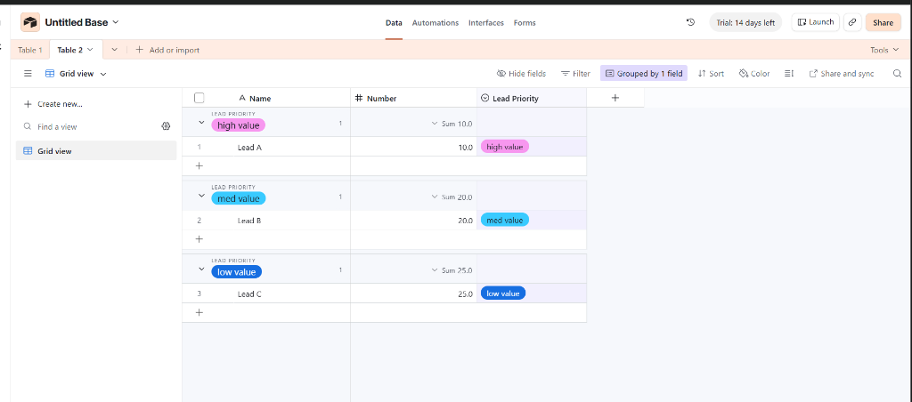

# Growify Performance Marketing Data Pipeline and Analytics Application

This repository contains a comprehensive data engineering and analytics pipeline developed for Growify. The project demonstrates the end-to-end processing of marketing performance and e-commerce sales data, from raw data ingestion and cleaning to advanced SQL modeling and AI-driven insights generation.

## Project Architecture

The architecture consists of five primary analytical components:

1. Tool Grasping & Lead Management (Airtable Setup)
2. Data Extraction and Transformation (ETL in Python)
3. Relational Database Modeling (Star Schema in SQLite)
4. Business Intelligence Semantic Layer (DAX Metrics in Power BI)
5. AI Insight Generation Tool (Text-to-SQL Streamlit App)

## Repository Structure

The project has been organized into distinctly separated files corresponding to individual task requirements:

- `assets/airtable_screenshot.png`: Screenshot of the completed Airtable onboarding and grouping task.
- `Task_1_Data_Cleaning.py`: The core Python ETL script handling missing values, standardizing dates, resolving numeric sign discrepancies, parsing campaign taxonomies, and generating calculated metrics.
- `Task_1_Data_Quality_Report.md`: A comprehensive data quality audit log generated post-execution of the ETL pipeline, documenting the specific transformations applied to the raw datasets.
- `Task_2_SQL_Schema.sql`: Database schema definition containing DDL statements for establishing the unified star schema (`growify.db`).
- `Task_2_SQL_Queries.sql`: A collection of essential SQL queries designed to feed downstream Business Intelligence tools and validate fact-dimension relationships.
- `Task_3_PowerBI_DAX_Measures.txt`: Defined DAX measures required for Power BI semantic modeling, providing logic for spend, ROI, CTR, and period-over-period calculations.
- `Task_4_Bonus_AI_Tool.py`: A Streamlit application integrating Large Language Models (LLM) with the SQLite database to facilitate natural language querying of marketing performance.
- `Task_4_Bonus_AI_Tool_README.md`: Specific technical documentation detailing the architecture, auto-correction loop, and usage of the AI Insight tool.

## Airtable Task (Task 1)

As part of demonstrating grasping skills with modern data tools, a lead management base was set up in Airtable:
* **Columns**: Name, Number, and Lead Priority (Single Select with options: `High Value`, `Med Value`, `Low Value`).
* **Grouping**: Dynamic grouping by the `Lead Priority` field to segment prospects effectively.
* **View**: A customized grid view displaying organized lead data.

Below is the verified screenshot of the Airtable base setup:



You can also view the screenshot file directly here: [assets/airtable_screenshot.png](./assets/airtable_screenshot.png)

## Setup Instructions

### Environment Configuration

Ensure you have Python 3.9+ installed. Install the necessary dependencies via the requirements file:

```bash
pip install -r requirements.txt
```

### 1. Data Processing Execution

Execute the data cleaning and ingestion script. This operation will process `Campaign_Raw.csv` and `Raw_Shopify_Sales.csv`, create the `data/` directory, and output the SQLite database files.

```bash
python Task_1_Data_Cleaning.py
```

Upon successful execution, the following database assets will be generated:
- `data/growify.db`: The unified star schema integrating both marketing performance and sales data.
- `data/cleaned_campaigns.db`: Isolated marketing performance data.
- `data/cleaned_Shopify.db`: Isolated e-commerce sales data.

### 2. Business Intelligence Integration

The generated `growify.db` can be directly connected to Power BI via the standard ODBC or SQLite connector. Utilize the measures defined in `Task_3_PowerBI_DAX_Measures.txt` to construct the semantic model.

### 3. AI Insight Tool Configuration

To leverage the AI capabilities, an API key must be configured. Create a `.env` file in the root directory:

```bash
GEMINI_API_KEY=your_gemini_api_key_here
```

Launch the Streamlit application:

```bash
streamlit run Task_4_Bonus_AI_Tool.py
```

## Technical Implementation Details

- **Data Imputation Strategy**: Missing dates in sales data were reconstructed using transaction timestamps. Missing metric records in campaign data were isolated for audit.
- **Normalization**: Negative metrics resulting from systemic sign-flips were corrected via absolute value transformations. *Note: Absolute correction was only applied where business logic indicated sign inversion rather than transactional reversals.*
- **Schema Design**: The implementation utilizes a central `date_dimension` linked to `campaign_performance` and `shopify_sales` fact tables to enable cross-functional reporting. *Note: The schema is a "lightly denormalized star schema" intentionally used to simplify Power BI relationships, where some campaign dimensions are kept within the fact tables instead of branching out into a snowflake pattern.*
- **Query Optimization**: Indexes were selectively applied to the `date_key`, `brand`, `funnel_stage`, `region`, `ad_format`, and `ad_category` columns in SQLite to significantly accelerate data retrieval patterns expected from both the Power BI dashboards and the AI Chatbot, which frequently filter and join across these specific dimensions.
- **AI Text-to-SQL Architecture**: The Streamlit tool dynamically injects the database schema into the LLM context, allowing generation of strict SQLite syntax. An auto-correction loop is implemented to catch and rectify execution errors in real-time.
