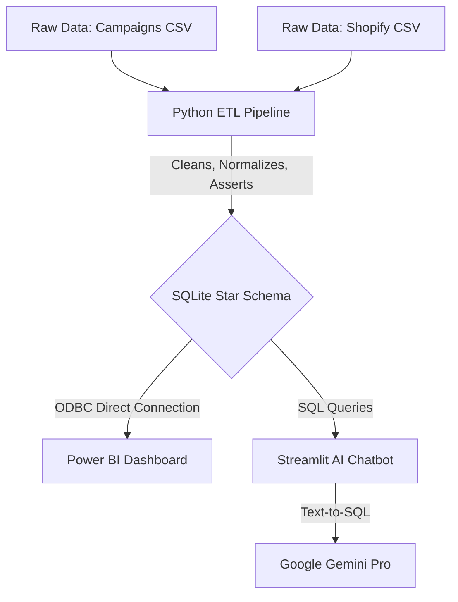
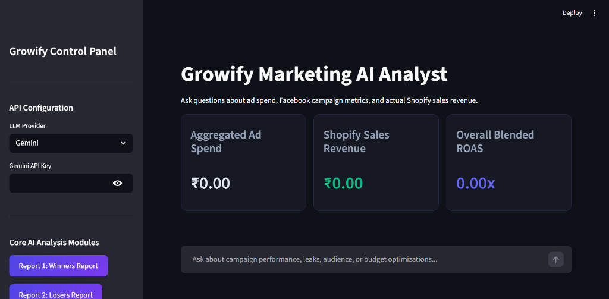

# Growify Marketing Data Engineering & Analytics Pipeline

 *(Replace with actual dashboard screenshot/PDF path)*

> **[🎥 View Full Video Explanation Here]** *(Add Loom/YouTube link here)*

## 📌 Project Overview
This repository contains a full-stack, end-to-end data engineering and analytics solution for Growify's marketing operations. It ingests raw messy CSVs, cleans and structures them into a highly optimized SQLite Star Schema, connects seamlessly to Power BI via ODBC for executive reporting, and provides a Streamlit-based AI chatbot for Text-to-SQL ad-hoc querying.

---

## 🏗️ Architecture & Data Flow



### Why a SQL-First Architecture?
Instead of forcing Power BI and AI tools to ingest messy flat CSVs, this project uses a centralized **SQLite** database. 
1. **Single Source of Truth**: Metrics like `CTR` and `ROAS` are calculated consistently in one place.
2. **Performance**: SQLite indexing allows rapid queries even as rows scale.
3. **AI Accuracy**: A structured, constrained Star Schema drastically reduces LLM hallucinations during Text-to-SQL translation compared to querying wide, messy DataFrames.

### ETL Flow (`Task_1_Data_Cleaning.py`)
1. **Extraction**: Loads raw CSVs using Pandas.
2. **Transformation**:
   - Applies robust Regex (`\bUK\b`) to parse Regions without false positives (e.g., matching "business" as "US").
   - Resolves severe metric discrepancies (e.g., Clicks > Impressions).
   - Inverts logically negative financial metrics into `.abs()` absolute values.
   - Maps all 50+ column names to standard SQL `snake_case`.
3. **Loading**: Connects to SQLite, forces `PRAGMA foreign_keys = ON`, executes the DDL `schema.sql` to enforce database-level constraints (like `CHECK (ctr >= 0)`), and bulk inserts the cleaned data.

---

## 💾 SQL Schema Design

All SQL definitions have been centralized into `sql/schema.sql`.

- **`date_dimension`**: The central time-axis. E-commerce sales and ad spend happen independently; a shared date table prevents joining anomalies in Power BI.
- **`campaign_performance`**: Fact table storing daily ad delivery. It remains lightly denormalized (keeping parsed dimensions like Region and Format inline) to simplify the JOIN complexity for the AI tool, enhancing LLM accuracy.
- **`shopify_sales`**: Fact table for order-level revenue. Notably, `order_id` is intentionally NOT a Primary Key to accommodate multiple line-items (products) per cart.

---

## 🤖 AI Workflow & Security

The `Task_4_Bonus_AI_Tool.py` script provides a Streamlit interface where users can ask plain English questions about their marketing performance.

### Security Decisions
Directly executing LLM-generated SQL against a database is inherently risky. To protect data integrity:
1. **Strict Query Prefixing**: The Python execution function uses regex and string validation to ensure the LLM's query **strictly** starts with `SELECT` or `WITH`.
2. **Blacklisted DDL/DML**: The tool actively scans and blocks destructive keywords (`DROP`, `DELETE`, `ALTER`, `UPDATE`, `INSERT`, `CREATE`, `REPLACE`).

 *(Replace with actual AI tool screenshot)*

### 10 Example AI Questions You Can Try
1. Which campaign had the worst CPC in March 2026?
2. Summarise UK performance in terms of ROAS and Spend.
3. Show me the top 3 ad formats by total conversions.
4. What is the total revenue generated on Shopify vs the total ad spend on Facebook?
5. Which funnel stage (TOF, MOF, BOF) has the highest CTR?
6. Identify days where ad spend exceeded 50,000 INR but sales were zero.
7. What is the average order value (AOV) for returning customers vs new customers?
8. Compare the ROAS of Brand A against Brand B.
9. Which specific ad set drove the highest number of 'Adds to Cart'?
10. Show the month-over-month trend of Total Conversions.

---

## 📊 Power BI Integration

The Power BI Dashboard strictly connects to the generated SQLite database (`data/growify.db`) via ODBC.

**Required Files**:
Please ensure the following files exist in the `/powerbi` directory:
- `/powerbi/dashboard.pbix`
- `/powerbi/dashboard_export.pdf`

---

## 📁 Airtable Integration


*(The screenshot above demonstrates the completed Airtable grouped view requirement).*

---

## 🚀 Setup & Execution

1. **Install Dependencies**:
   ```bash
   pip install -r requirements.txt
   ```
2. **Execute the ETL Pipeline**:
   ```bash
   python Task_1_Data_Cleaning.py
   ```
   *(This script handles everything dynamically via `os.path.dirname(__file__)`—no hardcoded paths required).*
3. **Run the AI Chatbot**:
   ```bash
   streamlit run Task_4_Bonus_AI_Tool.py
   ```
