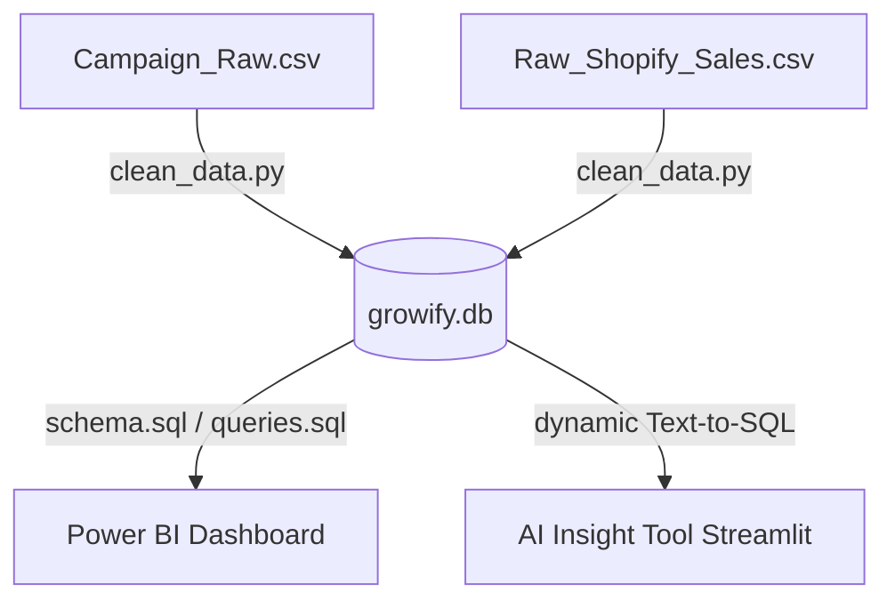

# Growify performance marketing: Data Analyst + AI Developer Pipeline

This repository contains the complete end-to-end data pipeline built for Growify. The pipeline processes raw, messy performance marketing and Shopify sales data, cleans and validates it using Python, loads it into a star-schema SQLite database, defines DAX measures for client reporting, and implements a Text-to-SQL AI Insight Chatbot.

---

## Directory Structure

```
├── data/
│   ├── growify.db                  # Unified SQLite database (SSOT)
│   ├── cleaned_campaigns.db        # Cleaned Campaign database
│   └── cleaned_Shopify.db          # Cleaned Shopify Sales database
├── python/
│   ├── clean_data.py               # Python cleaning & database loading pipeline
│   └── data_quality_report.md      # Detailed data quality audit log
├── sql/
│   ├── schema.sql                  # Database schema definitions and constraints
│   └── queries.sql                 # Queries for Power BI feeds & chatbot context
├── powerbi/
│   └── dax_measures.txt            # Copy-pasteable DAX measures & visualization guide
├── ai_tool/
│   ├── app.py                      # Streamlit chatbot application
│   └── README.md                   # Chatbot setup, architecture and sample questions
├── README.md                       # Main repository documentation
└── requirements.txt                # Python package dependencies
```

---

## Pipeline Architecture



### 1. Python Data Cleaning (`/python`)
- **Deduplication**: Exact duplicate rows are detected and removed.
- **Date Standardization**: Reconstructs missing dates in Shopify Sales from transaction timestamps, normalizes all date formats to `YYYY-MM-DD`.
- **Numeric Normalization**: Fixes negative values (spend, clicks, impressions) resulting from system sign-flips via absolute values.
- **Categorical Normalization**: Uniform casing and spacing mapping (e.g. platform casing, country names).
- **Recalculations**: Recomputes performance metrics (CTR, CPC, CPM, ROI, Net Sales, Total Sales) to guarantee accuracy.
- **Dimension Parsing**: Parses ad campaigns, adsets, and ads naming conventions into queryable star-schema sub-fields (Brand, Funnel Stage, Region, Creative Format, Target Audience, etc.).

### 2. SQL Star Schema Database (`/sql`)
- Database contains three tables: `date_dimension`, `campaign_performance`, and `shopify_sales`.
- Configured foreign key constraints and index structures on dates and campaign details to optimize query execution times.

### 3. Power BI Modeling & DAX (`/powerbi`)
- Star schema model relationships documented.
- Copy-pasteable DAX measures provided for client reporting (Spend, Revenue, CTR, CPC, ROAS, ROI, and MoM changes).

### 4. AI Insight Chatbot (`/ai_tool`)
- Streamlit application using LLM (Gemini) dynamic Text-to-SQL.
- Features auto-correction execution loop, conversational context memory, sidebar shortcuts for key analytical reports, and Plotly interactive chart rendering.

---

## Quick Start Setup

1. **Install Dependencies**:
   ```bash
   pip install -r requirements.txt
   ```

2. **Run Data Cleaning**:
   ```bash
   python python/clean_data.py
   ```
   This generates the databases inside the `data/` directory and updates `python/data_quality_report.md`.

3. **Configure API Key for AI Chatbot**:
   Set your API key in a `.env` file in the root directory:
   ```bash
   GEMINI_API_KEY=your_gemini_api_key_here
   ```

4. **Launch AI chatbot**:
   ```bash
   streamlit run ai_tool/app.py
   ```
